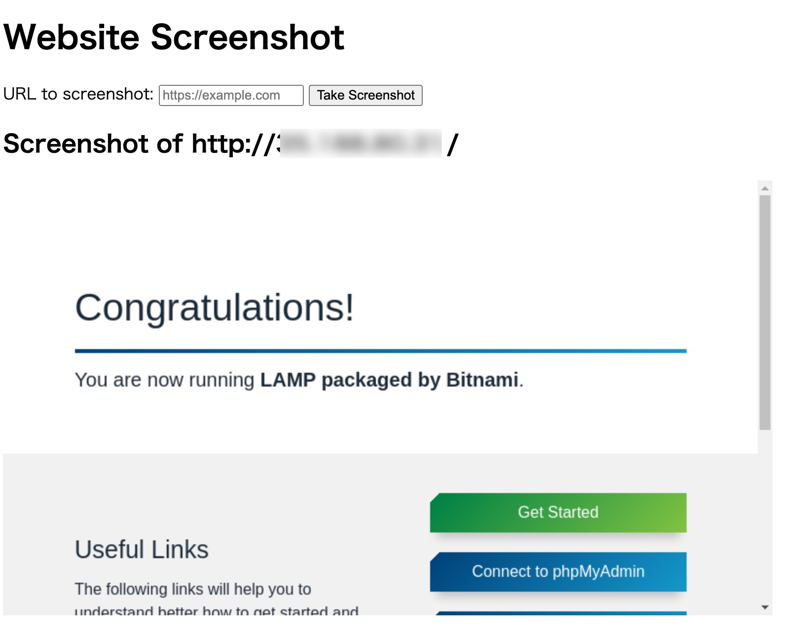

# Website Screenshot Application
This Flask application allows you to take screenshots of specified websites.
Users can input a URL, and upon clicking the submit button, the application captures a screenshot of the page and displays it on the web interface.

## Features
* Input a website URL and take a screenshot by clicking the "Take Screenshot" button.
* Displays the captured screenshot on the web page.
* Uses Selenium and Chrome WebDriver for capturing the screenshot.

## Requirements
* Python 3.10 or higher
* Docker (optional, for running the application in a container)

## Installation

1. Clone the repository:
    ```bash
    git clone <repository-url>
    cd <repository-name>
    ```

1. Set up a virtual environment (optional but recommended):
    ```bash
    python3 -m venv venv
    source venv/bin/activate  # On Windows, use `venv\Scripts\activate`
    ```

1. Install dependencies:
    ```bash
    pip install -r requirements.txt
    ```

4. Install Google Chrome and ChromeDriver (for local setup)
    Ensure you have Google Chrome and the corresponding version of ChromeDriver installed. You can download ChromeDriver [here](https://developer.chrome.com/docs/chromedriver/downloads?hl=ja).

## Usage
### Running the Application Locally
1. Start the Flask application:

    ```bash
    python app.py
    ```

1. Access the web interface:
    Open your browser and navigate to http://localhost:8080.

1. Take a screenshot:
    * Enter the URL you want to screenshot in the input field.
    * Click the "Take Screenshot" button.
    * The screenshot will be displayed on the page.


## Running with Docker
1. Build the Docker image:
   
    ```bash
    docker build -t screenshot_app .
    ```
   
2. Run the Docker container:

    ```bash
    docker run -p 8080:8080 screenshot_app
    ```
  
3. Access the application:

    Open your browser and go to http://localhost:8080.

## Project Structure
```
plaintext
.
├── app.py               # Main Flask application code
├── Dockerfile           # Docker setup to containerize the app
├── requirements.txt     # List of required Python packages
└── README.md            # Project 
```

## documentation
Dependencies
Flask: Web framework for creating the application.
Selenium: Tool for browser automation.
Google Chrome and ChromeDriver: Required for capturing screenshots in headless mode.

## Example
Open http://localhost:8080 in your browser.
Enter https://example.com (or any URL you want to capture) in the input field.
Click "Take Screenshot" and wait for the screenshot to load on the page.

## Troubleshooting
"Method Not Allowed" Error: Make sure you are using the form on the main page (http://localhost:8080) to submit the URL.
Docker Issues: Ensure that you are mapping port 8080 correctly and that Docker has access to a network.

## Deployment to Google Cloud Cloud Run

### Creating an Artifact Registry repository

    ```bash
    python3 -m venv venv
    source venv/bin/activate  # On Windows, use `venv\Scripts\activate`
    ```


    ```bash
    gcloud artifacts repositories create web-screen-shot \
        --repository-format=docker \
        --location=asia-northeast1
    ```

### Building a Docker image

    ```bash
    docker build -t asia-northeast1-docker.pkg.dev/[project-id]/web-screen-shot/my-image:latest .
    ```

### Local testing.

    ```bash
    docker run -p 8080:8080 asia-northeast1-docker.pkg.dev/[project-id]/web-screen-shot/my-image:latest
    ```

### Push to Artifact Registry

    ```bash
    docker push asia-northeast1-docker.pkg.dev/[project-id]/web-screen-shot/my-image:latest
    ```

### Cloud Run Deploy
    ```bash
    gcloud run deploy my-service \
        --memory=1024Mi \
        --image asia-northeast1-docker.pkg.dev/[project-id]/web-screen-shot/my-image:latest \
        --platform managed \
        --region asia-northeast1 \
        --allow-unauthenticated
    ```

### Confirmation of screenshots of web pages.
Access the public URL and send the URL of the web page to obtain a screen capture of the web page.




## License
This project is licensed under the MIT License. See the LICENSE file for more details.
